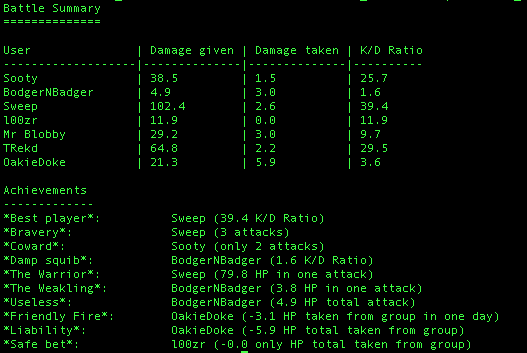

# habitica_hacks
Scripts for habitica based fun

## Scripts

### battle_summary.py


To use:

1. Go to Habitica [Social > Party](img/party.png), and copy the contents of the [party chat](img/party_chat.png) into a text file. I've called mine [`habitica_battle.txt`](data/habitica_battle.txt) and put it in the Downloads folder; if you choose somewhere different, replace `~/Downloads/habitica_battle.txt` in the usage below
1. Download the python file `battle_summary.py`
1. Open your terminal, navigate to where you downloaded it, and run the example usage
1. The output is in markdown format, you can paste it back into the party chat to get a formatted table

Example usage:
```bash 
cat ~/Downloads/habitica_battle.txt | python battle_summary.py
```

Example outputs:
```
Battle Summary
==============

User               | Damage given | Damage taken | K/D Ratio
-------------------|--------------|--------------|----------
Sooty              | 38.5         | 1.5          | 25.7     
BodgerNBadger      | 4.9          | 3.0          | 1.6      
Sweep              | 102.4        | 2.6          | 39.4     
l00zr              | 11.9         | 0.0          | 11.9     
Mr Blobby          | 29.2         | 3.0          | 9.7      
TRekd              | 64.8         | 2.2          | 29.5     
OakieDoke          | 21.3         | 5.9          | 3.6      

Achievements
-------------
*Best player*:  	Sweep (39.4 K/D Ratio)  
*Bravery*:      	Sweep (3 attacks)  
*Coward*:       	Sooty (only 2 attacks)  
*Damp squib*:   	BodgerNBadger (1.6 K/D Ratio)  
*The Warrior*:  	Sweep (79.8 HP in one attack)  
*The Weakling*: 	BodgerNBadger (3.8 HP in one attack)  
*Useless*:      	BodgerNBadger (4.9 HP total attack)  
*Friendly Fire*:	OakieDoke (-3.1 HP taken from group in one day)  
*Liability*:    	OakieDoke (-5.9 HP total taken from group)  
*Safe bet*:     	l00zr (-0.0 only HP total taken from group) 
```

Example input:  
[Input file](data/habitica_battle.txt)

